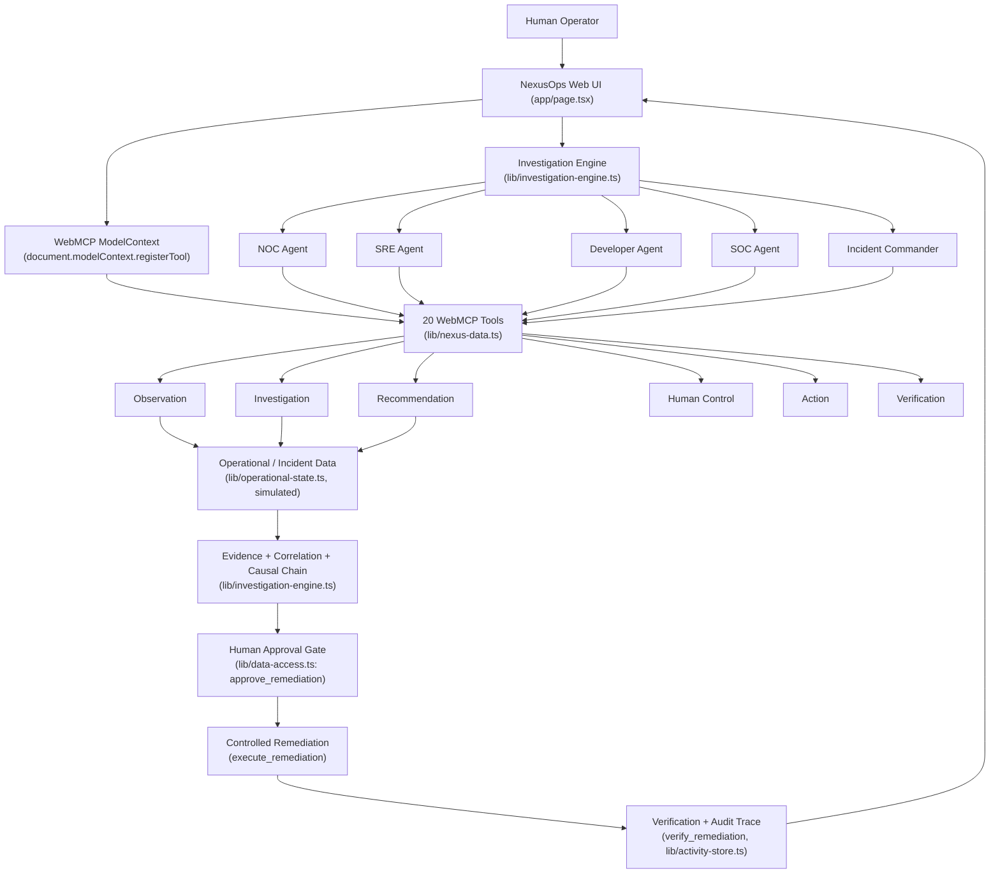

# NexusOps

**An agent-native operations control plane, built on WebMCP.**

NexusOps is a simulated Site Reliability / IT-operations command center where specialized agent roles — SRE, NOC, Developer, SOC, and an Incident Commander — investigate a live production incident by directly calling 20 real WebMCP tools exposed on this page, independently disagree about the root cause, have that disagreement arbitrated with evidence, and hand a proposed remediation to a human for explicit approval before anything executes.

- **Live demo:** https://nexusops-nu.vercel.app/
- **Repository:** https://github.com/MariamBodokia/nexusops
- **License:** MIT — see [`LICENSE`](./LICENSE)

> **This is a simulated environment.** The incident (`INC-1042`), its services, metrics, logs, deployments and timeline are deterministic, hardcoded demo data (`lib/operational-state.ts`). No real production system is monitored or affected. The "remediation" executed by the app is a simulated, non-destructive state change used to demonstrate the approval → action → verify loop, not a real infrastructure operation.

## The problem

Incident response tooling today is either fully manual (a human clicking through dashboards) or fully automated (a bot with unsupervised write access). Neither lets an AI agent meaningfully help *investigate* production issues while keeping a human as the sole authority over anything destructive.

## Why WebMCP is essential here

WebMCP makes a third mode possible: an agent operating directly on the same page a human is looking at, through capabilities the page itself defines, describes, and controls.

- **Why this use case fits WebMCP:** operations tooling is naturally page-shaped (services, incidents, metrics, logs) and naturally requires both machine speed and human judgment — exactly what `document.modelContext.registerTool()` is for.
- **How WebMCP creates a better experience:** a compatible agent can discover the full operational tool surface at runtime instead of needing a bespoke API integration per tool, and the human sees the *exact same* execution trace and results the agent produced, because it is the same page and the same tool calls — not a separate backend the human can't inspect.
- **What becomes possible that wasn't before:** an agent can read incident state, correlate deployments/metrics/logs, and propose a fix — but the destructive action (`execute_remediation`) is registered as a tool that only succeeds after a separate, human-only tool (`approve_remediation`) has already recorded approval for that exact incident and action. That safety boundary lives in the same tool graph the agent is exploring, not in a UI-only check that an agent could bypass by calling an API directly.

## What humans can do

- Open **WebMCP Tools** and inspect any of the 20 registered tools — description, category, risk level, read/write classification, human-approval requirement, and which agent roles use it — then execute it directly and see the real structured result.
- Run the **Investigation** and watch four agent perspectives independently analyze the same incident, disagree, and see the Incident Commander's arbitrated conclusion and the derived evidence/causal chain.
- Review the recommended remediation's rationale, then explicitly **approve** or decline it — the app never approves or executes on its own.
- Watch the **Agent Activity** audit trail, filterable by agent, showing every real tool call, its arguments, duration, risk, and result.

## What agents can do

- Discover all registered capabilities via `document.modelContext.registerTool()` — no separate API docs, auth, or SDK needed.
- Call observation tools (`get_services`, `get_metrics`, `get_logs`, `get_deployment_history`, ...) to gather real evidence from the simulated environment.
- Call investigation tools (`compare_metrics`, `correlate_events`, `run_diagnostic`, `get_incident_timeline`) to build a case.
- Call `propose_remediation` to hand a human a reviewable recommendation — but `execute_remediation` only succeeds once a human-attributed `approve_remediation` call has already been recorded for that incident and action.

## What human + agent collaboration makes possible

A human and an agent can look at the same incident through the same tools and reach a shared, auditable conclusion — the agent does the wide, fast evidence-gathering across ~20 data points, while the human retains the one decision that matters (whether to act). Neither role can silently override the other: the agent cannot execute without recorded approval, and the human's approval is itself a real tool call, not a client-side flag.

## The investigation lifecycle

```
OBSERVE → INVESTIGATE → MULTI-AGENT DISAGREEMENT → INCIDENT COMMANDER ARBITRATION
        → RECOMMEND → HUMAN APPROVAL → ACTION → VERIFY
```

The simulated scenario is **INC-1042 — P1 Payment API degradation**, caused (in the simulated data) by a deployment that changed database connection-pooling configuration.

## The 20 WebMCP tools

All tools are defined in `lib/nexus-data.ts` and registered with the real `document.modelContext.registerTool()` API in `app/page.tsx`. Each carries a description written for an external agent (what it does, when to use it, and its safety implications), plus catalog metadata (`readOnly`, `riskLevel`, `requiresApproval`, `agentRoles`) surfaced in the Tool Inspector.

**Observation** (read-only, low risk): `get_active_incidents`, `get_incident`, `get_services`, `get_incident_evidence`, `get_service_health`, `get_dependencies`, `get_deployment_history`, `get_metrics`, `get_logs`, `get_agent_activity`.

**Investigation** (read-only, low/medium risk): `get_incident_timeline`, `compare_metrics`, `correlate_events`, `run_diagnostic`, `create_investigation_finding` (the only mutating tool in this group — it appends a finding to the record).

**Recommendation** (read-only, medium risk): `propose_remediation` — generates a recommendation; never executes anything.

**Human control** (mutating, medium risk): `approve_remediation` — the human-only tool that records explicit approval.

**Action** (mutating, high risk, `requiresApproval: true`): `execute_remediation` — rejected unless a matching `approve_remediation` call was already recorded for the same incident and action.

**Verification** (read-only, low risk): `verify_remediation`, `verify_incident` — report the real, current (possibly still-unresolved) state, not a canned success.

## Multi-agent investigation, disagreement and arbitration

`lib/investigation-engine.ts` runs a real sequence of ~13 WebMCP tool calls, extracts evidence from the actual results, and then generates four **agent perspectives**, each reading a different slice of the same evidence pool:

| Agent | Focus | Tools it consults |
|---|---|---|
| **SRE Agent** | Resource / database connection saturation | `get_service_health`, `get_metrics`, `compare_metrics` |
| **NOC Agent** | Incident timing, sequencing, dependency health | `get_incident`, `get_incident_timeline`, `get_dependencies` |
| **Developer Agent** | Deployment/configuration regressions, logs | `get_deployment_history`, `get_logs`, `correlate_events` |
| **SOC Agent** | Ruling a security cause in or out | `get_logs`, `get_incident_evidence`, `correlate_events` |

Each agent produces its own hypothesis and a confidence score derived deterministically from real evidence (metric deltas vs. baseline, timing gaps in minutes, log pattern matches) — never randomized. An **Incident Commander** then arbitrates (`arbitratePerspectives`): it does not simply pick the highest confidence score, it checks for cross-agent evidence corroboration and explicitly explains why the losing hypotheses were not chosen.

> **Honesty note:** these four "agents" are specialized, deterministic analysis functions over real WebMCP tool results — not four independent LLM calls. What's real is the tool-driven evidence pipeline, the disagreement it can genuinely produce, and the human-approval boundary around any action.

## Evidence correlation and causal chain

`buildCausalChain` derives a chain such as *deployment → configuration change → DB connection utilization → application error signal → HTTP 5xx rate → latency increase → incident* directly from the real evidence objects gathered during the run (deployment version/change text, metric peaks, log descriptions) — it is not a static, hardcoded diagram.

## Human approval safety model

`execute_remediation` is enforced in the data layer (`lib/data-access.ts`), not just disabled in the UI: it checks that a matching `approve_remediation` call was already recorded for that incident and action, and returns a `blocked` result otherwise. `verify_remediation` / `verify_incident` reflect the real, mutated operational state afterward, so verification can only report recovery once remediation has actually run.

## Investigation / audit trace

Every tool execution — whether triggered by the Tool Inspector, the Investigation engine, or a real external WebMCP agent — is recorded exactly once, in one place (`lib/activity-store.ts`, called from `lib/nexus-data.ts#executeTool`), with timestamp, attributed agent, arguments, duration, success/failure, and a summary. The Agent Activity page can filter this trail by agent.

## Technical architecture

- `lib/operational-state.ts` — the deterministic **simulated** operational data (services, incident, metrics, logs, deployments, timeline).
- `lib/data-access.ts` — `invokeTool()`, the real handler behind every tool, including the human-approval gate and post-remediation state mutation.
- `lib/nexus-data.ts` — the WebMCP tool catalog (schemas + risk/role metadata) and `executeTool()`, the single execution + audit-logging path used everywhere.
- `lib/investigation-engine.ts` — runs the real tool sequence, extracts evidence, builds the timeline/signals, generates the four agent perspectives, arbitrates them, and derives the causal chain.
- `lib/activity-store.ts` — the shared Agent Activity audit trail.
- `lib/types.ts` — shared types (`Tool`, `AgentPerspective`, `CommanderAssessment`, `Investigation`, etc.).
- `components/live-investigation.tsx` — the Investigation UI (execution trace, agent disagreement, Commander assessment, evidence graph, human-approval remediation panel).
- `app/page.tsx` — the app shell, the WebMCP tool registration effect, and the WebMCP Tool Console / Tool Inspector.
- `test.ts`, `tests/safety.test.ts` — lightweight, real (non-mocked) tests described below.

## High-Level Design



## Run locally

```bash
pnpm install
pnpm run dev
```

Open `http://localhost:3000`. No environment variables or credentials are required.

## Test WebMCP in Chrome

1. Use Chrome with WebMCP enabled (`chrome://flags/#enable-webmcp-testing`), or a compatible WebMCP-aware agent / browser (e.g. ChatGPT's in-app browser).
2. Open the deployed app or `localhost:3000`.
3. Open **WebMCP Tools** to confirm the 20 registered capabilities, and execute one directly to see a real structured result.
4. Open **Investigation** and run it to watch real tool calls populate the execution trace, agent disagreement, and Commander arbitration.
5. Check the browser console for `[NexusOps] WebMCP: N/20 tools registered.` — this reflects genuine registration, not a hardcoded "ACTIVE" state; the sidebar bridge status only reports ACTIVE once at least one tool is confirmed registered.
6. Check **Agent Activity** for the resulting audit trail.

## How an external agent interacts with NexusOps

An agent discovers the tool list through `document.modelContext.registerTool()` (no docs or SDK required), then can, for example: call `get_incident` and `get_metrics` to gather evidence, call `propose_remediation` to see a recommendation, and — only after a human has separately called `approve_remediation` — call `execute_remediation`. `verify_remediation` lets the agent (or the human) confirm whether the action actually resolved the incident.

### Example investigation flow

```
get_incident            → confirm INC-1042 details
get_deployment_history  → check for a recent regression-causing deployment
get_metrics             → quantify the degradation
compare_metrics         → measure drift from the healthy baseline
get_logs                → find the specific error/timeout signal
correlate_events        → cross-reference deployment + telemetry + logs
run_diagnostic          → structured diagnosis with confidence + next step
propose_remediation     → generate a reviewable recommendation
        ↓ human reviews evidence
approve_remediation     → human explicitly approves (required)
execute_remediation     → blocked unless approval above was recorded
verify_remediation      → confirms real recovery from mutated state
```

## Testing / build status

Verified locally at the time of writing:

- `pnpm exec tsc --noEmit` — passes.
- `pnpm run build` — passes (Next.js production build).
- `pnpm run test` — passes (`test.ts` exercises the full multi-agent investigation end-to-end; `tests/safety.test.ts` exercises the WebMCP execution path, the approval gate blocking `execute_remediation` before approval, successful approval → execution, and verification reflecting real pre/post state).

## Hackathon relevance

Built for the OpenAI WebMCP Challenge. NexusOps demonstrates:

- **WebMCP Leverage** — genuine `document.modelContext.registerTool()` registration of 20 tools, each with a real `execute` callback wired to the same execution path used everywhere else in the app (no fake bridge, no simulated tool discovery).
- **Execution** — a complete, working lifecycle from observation through human-gated action and verification, not just a technical proof of concept.
- **Potential Impact** — a concrete, transferable pattern for letting an agent investigate operational systems while keeping a human as the sole authority over destructive actions.
- **Creativity & Ambition** — multi-agent disagreement resolved by evidence-based arbitration, rather than a single agent narrating a predetermined conclusion.

## License

MIT License. See [`LICENSE`](./LICENSE).


## License

MIT License. See `LICENSE`.
